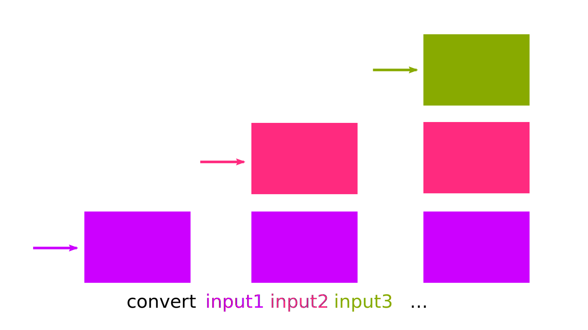
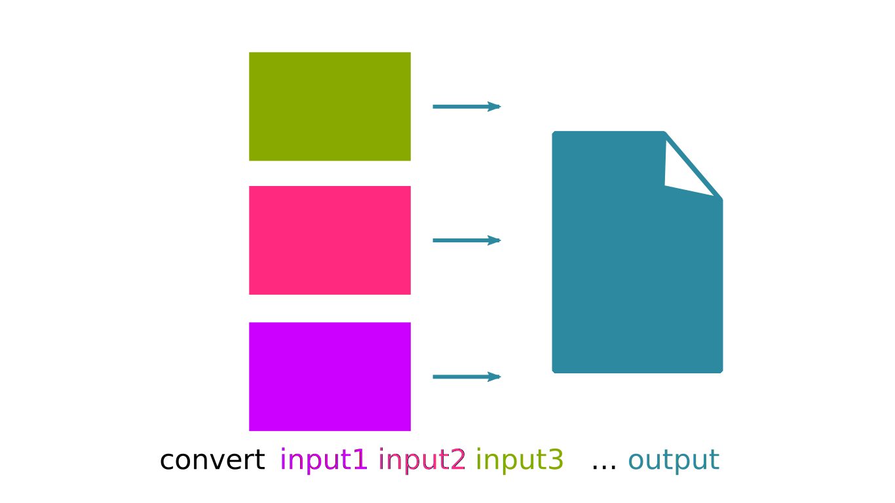
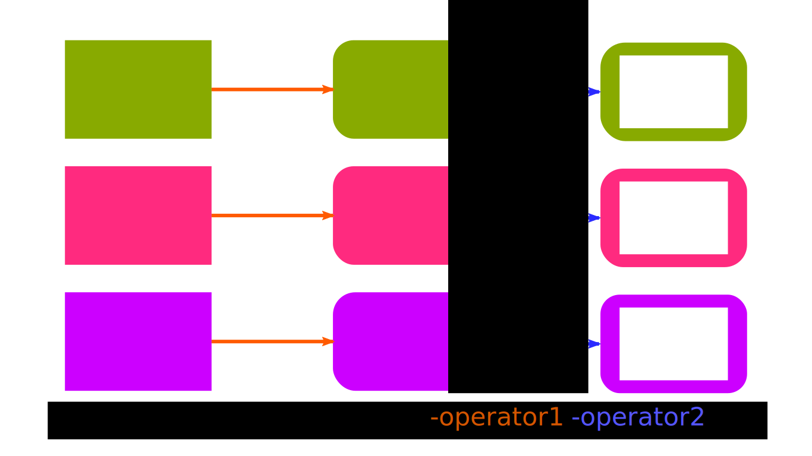
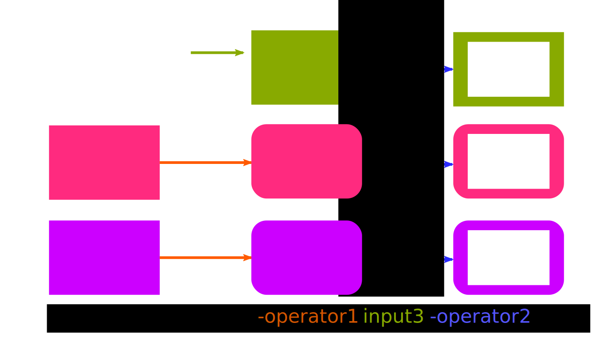
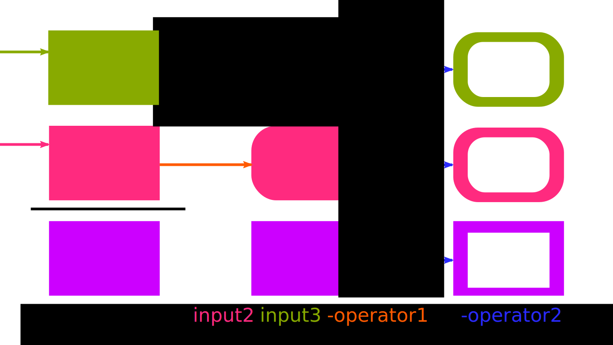
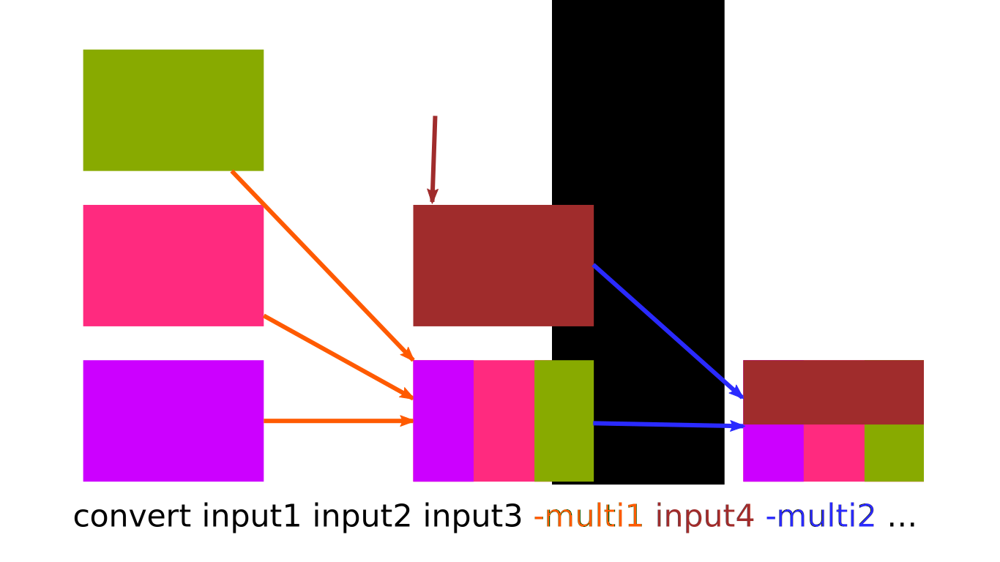
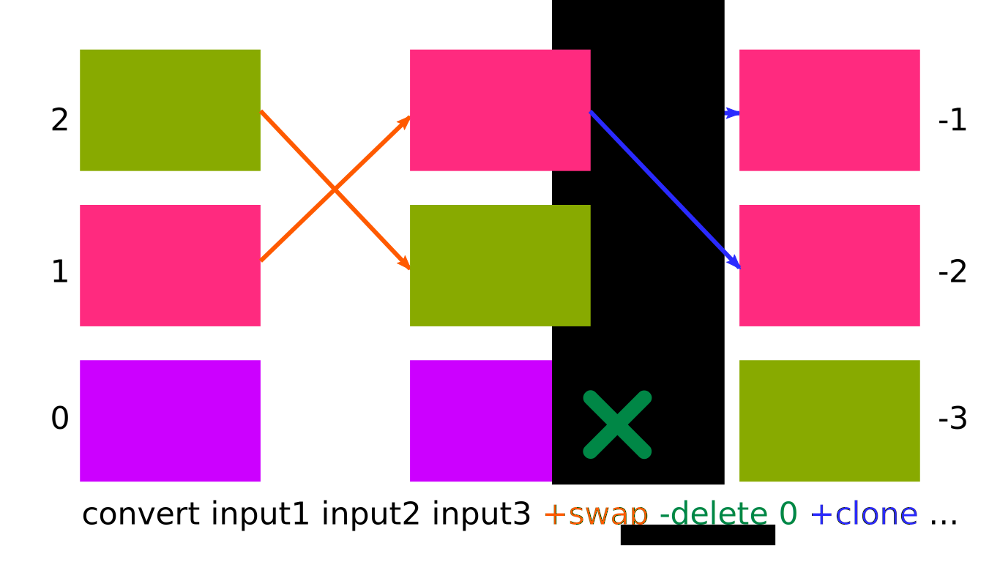

# Intro

## ¿Gráficos CLI?

Habiendo **Grafic** User Interfaces (GUI),\
¿para qué quiero un Command Line Interface?\
¿No es un **oxímoron**?

**Automatización con scripts:**

El original se actualiza y hay que reprocesar\
Hay muchos originales que procesar igual\
Los parámetros del procesado cambian

**Conversiones rápidas**

## Herramientas

**Pandoc:** Conversión de documentos de texto

**Imagemagick:** Procesado de imagen

**sox:** Procesado de audio

**ffmpeg:** Procesado de video

**PDFtk:** Manipulación de PDF's

# ImageMagick

## ¿Qué es?

Herramienta de manipulación de imágenes
por línea de comandos.

Conjunto de utilidades CLI

`animate`,
`compare`,
`composite`,
`conjure`,
`convert`,
`display`,
`identify`,
`import`,
`mogrify`,
`montage`,
`stream`...

Se puede hacer todo con `convert`,
los otros son alias para indicar
entradas, salidas o opciones.

:::notes
Incluye una interfaz GUI, bastante cutre.

También hay una libreria C (con bindings Python y demás)

- `convert`: Pipe simple entrada salida
- `display`: Visualiza la imagen en el GUI
- `animate`: Visualiza una imagen con animacion en el GUI
- `import`: Captura la pantalla
- `identify`: Identifica el tipo de imagen
- `mogrify`: Modifica una imagen inplace (resize, rotate...)
- `composite`: Combina imágenes una encima de otra
- `compare`: Crea la diferencia de varias imágenes
- `montage`: Genera un montage de varias imágenes dispuestas
- `stream`: Procesa linea a linea. útil para imágenes grandes
- `conjure`: Interpreta scripts complejos (lenguage msl)
:::

## Ejemplos simples

```bash
# Convertir un png en jpg
convert imagen.png imagen.jpg

# Varios pngs en un gif animado
convert imagen_*.png imagen.gif

# Juntar varios pngs como paginas de un pdf
convert imagen_*.png imagen.pdf

# Renderizar las paginas del pdf por separado
convert documeto.pdf documento-pagina.png
# Genera documento-pagina-N.png, donde N es la página
```

::: notes
**Ojo:**
Para partir las páginas de un pdf,
normalmente queremos mantener el pdf vectorial.
PDFtk para eso.
Imagemagic renderiza el raster.
:::


## Se puede complicar

```bash
convert -size 120x160 \
	-style italic -weight 600 label:A  -negate \
	\( +clone  -shade 110x90 -normalize -negate +clone \
		-compose Plus -composite \) \
	\( -clone 0 -shade 110x50 -normalize \
		-channel BG -fx 0 +channel -matte \) \
	-delete 0 +swap \
	-compose Multiply -composite \
	button.gif
```

::: notes
La documentación explica mucho de cada opción
pero es complicado de encontrar la explicación
general de como juntar las opciones.

La clave es entender que hay diferentes tipos de opciones
y de que tipo es cada una.
:::

## Elementos de la CLI

Entradas y salidas

Parámetros de configuración

Operadores de imagen

Operadores de múltiples imágenes

Operaciones de pila

Operaciones de canal

::: notes
Las **entradas y salida** especifican las fuentes y el destino de imágenes.
Pueden ser ficheros o otras cosas.
El último parámetro se supone la salida.

Para algunos subcomandos, entrada o salida es implícita
y no se indica (`import`, `display`, `mogrify`...)

Los **operadores de imagen** modifican las entradas especificadas con anterioridad al operador

Los **operadores de múltiples imagenes**,
juntan de una manera o otra
todas las entradas especificadas con anterioridad en una sola imagen.

Las **operaciones de pila**, permiten acceder a las imágenes anteriores, cambiar su orden...

Los `\(` paréntesis escapados `\)` son útiles para limitar las imágenes afectadas 
por los operadores.

Las **opciones de configuración**, modifican valores de parámetros.
Afecta a entradas, salidas y operadores especificadas después en la línia de comandos.
No les afectan los paréntesis.
:::

## Entradas

::: notes
Se añaden a la pila de imagenes.

Lo normal es que sean ficheros de imagen.

Pueden ser dispositivos, entradas virtuales, tener modificadores...

Pueden ser ficheros multiframe (videos o animaciones) o multi-página (pdf's),
en ese caso se añade a la pila una imagen por frame/página.

Se puede seleccionar en la entrada un recorte o un frame/página.

**Importante:** La primera imagen fija los valores por defecto para la mayoría de parámetros:
tamaño, profundidad, espacio de colores...
:::



## Salida



::: notes
El último parámetro.

Puede ser fichero o otras cosas también:

`x:` lo muestra por pantalla

`-` lo envia por salida estandard

`printer:` lo imprime por la impresora

`null` ignora la salida

Si el formato de salida soporta múltiples imagenes como frames o páginas (GIF, PDF...)
genera un solo fichero.

Si no, genera un fichero por imagen con un sufijo.
:::

## Operadores de imagen



::: notes
Son filtros que se aplican imagen a imagen.

Se aplican a todas las imagenes que tengamos en la pila
generando nuevas versiones de éstas.
:::

## Aplicación parcial



:::notes
Los operadores se aplican solo a las entradas
especificadas antes en la línia de comandos.

En este ejemplo:

- El `-operador1`, en naranja, no se aplica al `input3`
- En cambio, el `-operador2`, en azul, se aplica a todos
:::

## Paréntesis



:::notes
Se pueden usar los paréntesis
(escapados con contrabarras en `bash`)
para limitar hacia atrás el alcance de los operadores.

En este otro ejemplo:

- El `-operador1`, en naranja, no se aplica al `input1`
- En cambio, el `-operador2`, en azul, una vez cerrado el paréntesis ya se aplica a todos
:::

## Ops Multi-imagen



:::notes
Colapsan las imagenes en una (por justaposición, composición...)

Si están dentro de paréntesis, sólo ve las imágenes que también están dentro.

Podemos aplicar más de uno pero necesitaremos más inputs después de aplicar el primero.
:::

## Operadores de pila



:::notes
A menudo el orden de pila es demasiado extricto.

Los operadores de pila alteran la pila directamente, no el contenido de las imágenes.

```bash
-clone <indexes> # Crea duplicados encima
-delete <indexes> #  Borra de la pila
-insert <index> # Mueve el -1 a <index>
-swap <index>,<index> # Intercambia imagenes
```

Indices en 0 desde abajo; negativos por arriba.

Secuencias `0,3,7`, intérvalos `2-7`, por la cola `-2`

`+clone`, `+delete`, `+swap` es como indicar el o los últimos.

seguiran siendo clones por que les aplicaremos los mismos efectos.
:::


## Operadores de canal

TODO: Aún no los he entendido

## Configuración

Parametrizan la lectura y escritura de imágenes
y la aplicación de efectos.

Afectan a los input, outputs, operadores, que aparezcan detrás
en la línia de commandos

No hacen nada a la imagen de por sí

::: notes
- `‑region <geometry>` Limita el efecto de subsiguientes operadores, `+region` la elimina
- `‑adjoin`
- `‑affine`
- `‑alpha`
- `‑antialias`
- `‑authenticate`
- `‑background`
- `‑bias`
- `‑black‑point‑compensation`
- `‑blue‑primary`
- `‑bordercolor`
- `‑caption`
- `‑channel`
- `‑comment`
- `‑compress`
- `‑debug`
- `‑define`
- `‑delay`
- `‑density`
- `‑depth`
- `‑direction`
- `‑display`
- `‑dispose`
- `‑dither`
- `‑encoding`
- `‑endian`
- `‑extract`
- `‑family`
- `‑fill`
- `‑filter`
- `‑font`
- `‑format`
- `‑fuzz`
- `‑geometry`
- `‑gravity`
- `‑green‑primary`
- `‑interlace`
- `‑intent`
- `‑interpolate`
- `‑label`
- `‑limit`
- `‑linewidth`
- `‑log`
- `‑loop`
- `‑mattecolor`
- `‑monitor`
- `‑orient`
- `‑page`
- `‑pointsize`
- `‑preview`
- `‑quality`
- `‑quiet`
- `‑read‑mask`
- `‑red‑primary`
- `‑render`
- `‑repage`
- `‑sampling‑factor`
- `‑scene`
- `‑seed`
- `‑size`
- `‑stretch`
- `‑stroke`
- `‑strokewidth`
- `‑style`
- `‑texture`
- `‑tile`
- `‑transparent‑color`
- `‑treedepth`
- `‑type`
- `‑undercolor`
- `‑units`
- `‑verbose`
- `‑virtual‑pixel`
- `‑weight`
- `‑write‑mask `
:::


# Entradas y Salida

## Tipos

Ficheros (globs y formateo)

Imágenes y patrones built-in

Dispositivos: stdio, pantalla, scanner, impresora...

Frame/página o recorte escogido

Entrada reescalada

Ficheros con formato explicito

Índice de ficheros

::: notes
Los ficheros de entrada pueden indicarse con globing (`frame*.png`) que se resuelve a parte del propio globbing de `bash`.

Por eso, si añadimos modificadores de entrada al fichero, el globbing sigue funcionando.

Los ficheros de salida pueden ir con template de formateo tipo `printf` (`frame_%03d.jpg`) para las salidas múltiples.

Por defecto si la salida es `frame.jpg` y hay más de una entrada, genera los nombres con `frame-%d.jpg`,
sin cero padding que es complicado de ordenar.
:::


## Imágenes built-in

```bash
convert logo: logo-imagemagick.svg
```

{style="width:40%"}

::: notes
Muy útiles para hacer pruebas.

- `logo:` el logo de imagemagick
- `rose:` una foto de una rosa
- `granite:` una textura
- `netscape:` paleta de colores seguros de netscape
- `wizard:` otra imagen de la mascota

- `pattern:checkerboard` cuadros ajedrez
- `pattern:bricks` ladrillos
- `canvas:<color>` todo de un color (necesita -size)
- `gradient:[<color>-<color>]` gradiente vertical (necesita -size)a
- `radial-gradient:[<color>-<color>]` grandiente 
- `fractal:[<color>-<color>]` generador texturas (necesita -size)
- `plasma:` generador texturas (el mismo que `fractal`?)
- `label:<text>` linia de texto
- `caption:<text>` texto wrappeado
- `tile:<image>` Expande la imagen al size replicándola
:::

## Dispositivos

`-` stdin/out

`x:` de input captura la pantalla (como `import`)

`x:` de output muestra por pantalla (como `display`)

`scan:` entrada desde el scaner

`printer:` salida a impresora

`fd:<n>` file descriptor

`null` salida ignorada


## Formato Explícito

Normalmente se interpreta por el MAGIC de la entrada
o por la extensión de la salida.

```bash
# saca por pantalla formato XPM
# (Codigo C valido en el que se 've' la imagen en asci art)
convert rose: xpm:-

# Para ver los formatos soportados
convert -list format
```

::: notes
El MAGIC es una cadena de texto identificadora
que incluyen la mayoria de formatos modernos
para identificar el formato:
GIF, BMP, PNG...

```bash
# Lista de MAGICS
convert -list magic

# Lista de formatos soportados
convert -list format

# Lista de listas
convert -list list
```
:::

## Crop/Resize/Framing

Se puede hacer después con operadores

```bash
# Resize
convert '*.jpg[120x120]' thumbnail.png

# Subimagen con offset
convert '*.jpg[200x200+100+900]' thumbnail.png

# Escoger los frames
convert '*.gif[1,3-6]' thumbnail.png
```

Pero es mas rápido hacerlo al leer

::: notes
**Detalle:** los cochetes planos son símbolos especiales en bash y hay que usar comillas simples o dobles.

**Detalle 2:** En bash las comillas simples evitan el globing. Es ImageMagick, no bash, quien hace el globbing.
Bash no sabría con los modificadores ahí.
Tampoco con prefijos de formato explícito.
:::


## Fichero con lista de nombres


```bash
cat > ficheros.txt <<<EOF
fichero1.jpg
fichero2.jpg
otrofichero.jpg
EOF
convert @ficheros.txt -o salida.gif
```

::: notes
:::

# Opciones

## Tipos de opciones

Configuración

Operadores de imagen

Operadores multi-imagen

Operadores de pila


## Configuración

Parametrizan la lectura y escritura de imágenes
y la aplicación de efectos.

Afectan a los input, outputs, operadores, que aparezcan detrás
en la línia de commandos

No hacen nada a la imagen de por sí

::: notes
‑adjoin
‑affine
‑alpha
‑antialias
‑authenticate
‑background
‑bias
‑black‑point‑compensation
‑blue‑primary
‑bordercolor
‑caption
‑channel
‑comment
‑compress
‑debug
‑define
‑delay
‑density
‑depth
‑direction
‑display
‑dispose
‑dither
‑encoding
‑endian
‑extract
‑family
‑fill
‑filter
‑font
‑format
‑fuzz
‑geometry
‑gravity
‑green‑primary
‑interlace
‑intent
‑interpolate
‑label
‑limit
‑linewidth
‑log
‑loop
‑mattecolor
‑monitor
‑orient
‑page
‑pointsize
‑preview
‑quality
‑quiet
‑read‑mask
‑red‑primary
‑region
‑render
‑repage
‑sampling‑factor
‑scene
‑seed
‑size
‑stretch
‑stroke
‑strokewidth
‑style
‑texture
‑tile
‑transparent‑color
‑treedepth
‑type
‑undercolor
‑units
‑verbose
‑virtual‑pixel
‑weight
‑write‑mask 
:::

## Operaciones de imagen

Filtros: modifican una imagen generando otra

Se aplica a todas las entradas especificadas antes\
(si no está dentro de un parèntesis)

```bash
$ convert input1 -op1 input2 -op2 ...
# src0: input1 | op1 | op2
# src1: input2 | op2

$ convert input1 -op1 \( input2 -op2 \) -op3 ...
# src0: input1 | op1 | op3
# src1: input2 | op2 | op3
```


::: notes
‑annotate
‑black‑threshold
‑blur
‑border
‑charcoal
‑chop
‑clip
‑clip‑path
‑clip‑mask
‑colors
‑colorize
‑colorspace
‑compose
‑contrast
‑convolve
‑crop
‑cycle
‑despeckle
‑draw
‑edge
‑emboss
‑enhance
‑equalize
‑evaluate
‑extent
‑flip
‑flop
‑floodfill
‑frame
‑gamma
‑gaussian‑blur
‑grayscale
‑implode
‑lat
‑level
‑map
‑median
‑modulate
‑monochrome
‑negate
‑noise
‑normalize
‑opaque
‑ordered‑dither
‑paint
‑posterize
‑raise
‑profile
‑radial‑blur
‑raise
‑random‑threshold
‑resample
‑resize
‑roll
‑rotate
‑sample
‑scale
‑sepia‑tone
‑segment
‑shade
‑shadow
‑sharpen
‑shave
‑shear
‑sigmoidal‑contrast
‑solarize
‑splice
‑spread
‑strip
‑swirl
‑threshold
‑transparent
‑thumbnail
‑tint
‑transform
‑trim
‑unsharp
‑version
‑wave
‑white‑point
‑white‑threshold
:::

## Oper. Multi-imàgen

¿Qué hacemos con múltiples entradas?

Por defecto, 
Junta las entradas anteriores en una.
Indican que hacer con múltiples entradas.

Por defecto si es un gif, pdf o video,
los toma como frames o páginas, si no,
genera múltiples ficheros con sufijo numérico.

`-append`: junta las imagenes de norte a sur\
`+append`: junta las imagenes de izquierda a derecha\
`-composite`: mezcla las imagenes con el setting `-compose`

::: notes
‑append
‑affinity
‑average
‑clut
‑coalesce
‑combine
‑compare
‑complex
‑composite
‑copy
‑crop
‑debug
‑deconstruct
‑delete
‑evaluate‑sequence
‑fft
‑flatten
‑fx
‑hald‑clut
‑ift
‑identify
‑insert
‑layers
‑limit
‑map
‑maximum
‑minimum
‑morph
‑mosaic
‑optimize
‑print
‑process
‑quiet
‑swap
‑write
:::

## Operaciones de pila

```bash
-clone <indexes> # Duplica las imagenes, +clone la última
-delete <indexes> # 
-insert <indexes> # 
-swap <index>,<index> # Intercambia imagenes, +swap las dos ultimas
```

secuencias `1,3,7`, intérvalos `2-7`, por la cola `-2`

`+operador` implica `-1`, la útlima imagen

::: notes
Los otros operadores cogen la última imagen o las últimas imagenes.

Estos se saltan la lógica de pila y acceden directamente a su contenido.

`+clone` y `+swap` dentro de paréntesis para procesar múltiples veces una imagen

```bash
convert rose: \(+clone -flip +swap) \(+clone -rotate +swap) 
```
:::


