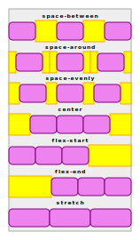

# CSS Flexbox

https://css-tricks.com/snippets/css/a-guide-to-flexbox/

El poster 

## Conceptos

Flexbox es uno de los varios sistemas en css para organizar la **disposición** (layout)
de elementos **hijos** en un elemento **contenedor**.
Otros sistemas de layout son el Normal Flow, Grid, Multicolumn...
En concreto, Flexbox es una generalización del sistema que se usa para los sistemas de escritura.

Por ejemplo: Cuando escribimos con nuestro sistema de escritura, el latino,
colocamos las palabras de izquierda a derecha 🡆 formando líneas.
Cuando ya no caben palabras a lo ancho, añadimos una nueva línea.
Estas líneas se colocan ordenadas de arriba a abajo 🡇.

Flexbox llamaría a la dirección de lectura **dirección principal**,
cada linea seria una **pista**,
y la direccion en la que vamos colocando las sucesivas lineas
sería la **dirección de cruce**.

Más generalmente, decimos que flexbox dispone el contenido por orden,
primero en una **direccion principal** formando una **pista** (track),
y, a medida que las pistas se completan, se añaden nuevas pistas
en orden en la **dirección de cruce**, perpendicular a la principal.

Un **flujo** (flow) es la combinación de una dirección principal (hacia la derecha, la izquierda, arriba o abajo)
y una dirección de cruce (siempre perpendicular pero hay dos sentidos posibles).

Estas generalizaciones nos permiten hablar de pistas sin pensar si son lineas/filas o columnas.
Para los ejemplos, aterrizaremos la generalización en el llamado _flujo normal_ que es el de lectura, en nuestro caso, latina.

## Activación del flexbox

Activamos flexbox definiendo para el contenedor la propiedad `display`
a los valores `flex` o bien `flex-inline`

```css
.container {
    display: flex;           /* o flex-inline */
}
```
La diferencia entre `flex` y `flex-inline`:

- "`flex`" se comporta dentro de su padre como un `div` (`display: block`).
- "`flex-inline`" se comporta dentro de su padre como un `span` (`display: inline`).


## Definiendo el flujo del contenedor

Puedes definir la dirección principal de un contenedor definiéndole la propiedad `flex-direction`:

- `row`: (por defecto) dirección de lectura (script latino: 🡆)
- `row-reverse`: dirección opuesta a la de lectura (script latino: 🡄)
- `column`: dirección de añadir lineas en el script del idioma (script latino: 🡇)
- `column-reverse`: dirección contraria a la de añadir líneas en el script del idioma (script latino: 🡅)

**Ojo:**
Estos valores estan definidos respecto a la direccion de lectura,
que cambia según el idioma:

- En idiomas que se escriben de derecha a izquierda (árabe, hebreo...)
`row` es 🡄
- En idiomas que se escriben de arriba a abajo (chino, japones, vietnamita, coreano...),
`row` es 🡇, ¡son columnas!

쯈ué pasa cuando se llena la pista?
Ese comportamiento lo fija la propiedad `flex-wrap` del container.

- Por defecto, (`nowrap`) siguen añadiendo elementos a la línea y hace `overflow`.
- Si vale `wrap`, se crean nuevas pistas (lineas) en la dirección perpendicular que no lleva `reverse`.
- Si vale `wrap-reverse`, se crean nuevas pistas (líneas), en la dirección perpendicular con `reverse`.

**Ojo!:**
El uso de `wrap-reverse`, `row-reverse` y `column-reverse`
puede ser contraproducente para usuarios de lectores de pantalla,
puesto que el orden de lectura seguirá siendo el de los elementos en el html.
No es que no se pueda usar, pero hay que tenerlo presente.

Se pueden juntar las propiedades `flex-direction` y `flex-wrap` en la propiedad fusionada `flex-flow` (direction, wrap)

```
.container {
    flex-flow: column wrap-reverse;
}
```

El flujo que llamabamos _normal_ seria el "`row wrap`", siempre que estemos en un script latino.
Es diferene del flujo por defecto que es "`row nowrap`".

## Flexibilidad de los elementos

Una de las potencias del flexbox es la capacidad que da a
los hijos para adaptarse al espacio existente **en la direccion principal**.
Esto está controlado por tres propiedades de los hijos: `flex-basis`, `flex-grow`, `flex-shrink`.

Una vez repartidos los items en cada pista, es posible que, en una pista, sobre o falte espacio.

Si sobra espacio, se reparte proporcionalmente al valor de la propiedad `flex-grow` de cada elemento.
Esta propiedad, por defecto, es 0, es decir que, si no especificamos un `flex-grow` el elemento no crecerá.
El crecimiento está limitado por el `max-height/width` del elemento.

쮺칩mo funciona este reparto proporcional?
Un ejemplo: Si en un track hay 4 elementos con grow 0, 1, 2 y, 2:

- El primero no crecerá aunque sobre espacio
- El segundo crecerá 1 píxel de cada 5 (0+1+2+2) píxeles sobrantes
- El tercero y cuarto crecerán 2 píxeles de cada 5 píxeles sobrantes

Si falta espacio, pasará lo an맓ogo usando la propiedad `flex-shrink`,
cada elemento se encogerá tantos pixeles proporcionalmente a su valor de `flex-shrink`.
Esta propiedad, por defecto, es 1, es decir que, si no especificamos ningún `flex-shrink` todos los elementos se encogerán por igual.
Ningún elemento se encogerá más allá de su `min-height/width`.

La propiedad `flex-basis` de los elementos hijos define el tamaño en el eje principal
que se tiene en cuenta para saber si sobra o falta espacio en la pista.
También es el tamaño a partir del cual crece o encoge el elemento.

`flex-basis` puede tener estos valores:

- `auto` (por defecto) usa el tamaño del width/height del elemento
- `max-content`: El tamaño del contenido maximo de los hermanos en la direccion de cruce
- `min-content`: El tamaño del contenido mínimo de los hermanos en la direccion de cruce
- `fit-content`: Todo el tamaño disponible hasta `max-width/heigh`
- `content` adapt to children content (La diferencia con auto es que delega en los hijos del elemento y no en el elemento)
- Cualquier otro tamaño en unidades que tambien pueden ser relativas al contenedor (%) o al view (vh,vw,vmin,vmax) o al espacio disponible (fr).
- También se pueden usar funciones como `calc`, `min`, `max`, `minmax`, `clamp`...

Se pueden juntar `flex-grow`, `flex-shrink` y `flex-basis` en la propiedad `flex`, donde se especifican por orden grow, shrink y basis.
Ademas puede usar algunos valores de atajo:

- `initial`: Equivalente a "`0 1 auto`". Los valores por defecto. No crecerá pero se puede encoger.
- `auto`: Equivalente a "`1 1 auto`". Crecerá o encogerá según se requiera.
- `none`: Equivalente a "`0 0 auto`". No se adaptará ni creciendo ni encogiendo.

## Ajustando/alineando los elementos

쯈ué hacer cuando el contenido no llena todo el espacio disponible?

Por defecto, el comportamiento es:

- Los elementos se apilarán al inicio de la pista en la dirección principal dejando cualquier espacio sobrante al final.
    - En flujo `row wrap`: los elementos se apilan a la izquierda de la linea.
    - `justify-content: flex-start`
- Las pistas de elementos se wrappearan al inicio de la direccion de cruce dejando cualquier espacio sobrante al final.
    - En flujo `row wrap`: las lineas se apilan arriba del contenedor.
    - `align-content: flex-start`
- Los elementos de cada pista se estiraran en el eje de cruce hasta alcanzar el tamaño del mayor elemento de la pista.
    - En flujo `row wrap`: los elementos expandiran su altura a la del elemento más alto de cada linea.
    - `align-items: stretch`

El comportamiento esta gobernado por las propiedades `justify/align-content/items`.
La propiedad `justify-items` no tiene sentido en Flexbox, pero sí se aplica en Grid.
La incluyo porque sirve para entender la lógica en los nombres de las propiedades.

Las propiedades empiezan por:

- `justify-*` cuando hablan de espacio extra en la **dirección principal**
- `align-*` cuando hablan de espacio extra en la **direccion de cruce**

En cada una de esas direcciones, podemos hablar de

- `*-content`: El espacio que sobra en la dirección, después de colocar todo el contenido
- `*-item`: El espacio en la dirección que le sobra a cada elemento dentro de la pista que atraviesa la dirección

Como en Flexbox no hay pistas que atraviesen la dirección principal, `justify-items` no tiene sentido.
En Grid sí, porque se definen pistas en las dos direcciones.

Volviendo a Flexbox, `align-items` para un flujo `row wrap`,
definiría como gestionar el espacio vertical de la linea que no llena el item.

Una vez definido los espacios sobrantes que queremos gestionar,
쯖칩mo lo hacemos? 쯤ué valores les podemos dar?



 Para`*-content`, el sobrante de todo el contenido en una dirección (`justify-content`, `align-content`):

- `flex-start` (default) ajusta los elementos al inicio del eje
- `flex-end` ajusta los elementos al final del eje
- `center` deja el mismo espacio a los dos lados del eje
- `stretch`: Se da el espacio extra a los items (en la principal, se reparte segun el grow)
- `space-arround`: Añade espacio alrededor de cada item.
    - Como si fuera un padding: en los extremos habrá la mitad de espacio que entre hijos.
- `space-between`: Añade espacio solo entre los elementos interiores.
- `space-evenly`: Añade el mismo espacio entre los elementos y en los extremos.

Para `*-item`, alineando los items dentro de su track
(~~`justify-items`~~, `align-items`):

- `flex-start` (default) se mueve el elemento en la pista hacia el inicio del eje
- `flex-end` se mueve e elemento en la pista hacia el final del eje
- `center` se deja el elemento en el centro de la pista en la dirección del eje
- `stretch`: Se estira el elemento para que ocupe toda la pista en la dirección del eje
- `baseline`: Se alinea con el baseline del resto de los elementos en la pista
- `first baseline`: TODO (no safari ni opera)
- `last baseline`: TODO (no safari ni opera)
- `safe <other>` if _other_ creates overflow, behave as `start` (solo firefox en 2022)
- `unsafe <other>` even if _other_ creates overflow, respect _other_ (solo firefox en 2022)


También tenemos propiedades de atajo:

- `place-items: <align> <justify>;`
- `place-content: <align> <justify>;`

Si los dos valores de align y justify son el mismo, se puede poner solo una vez.

## Gaps

Las propiedades `column-gap`, `row-gap` y la combinada `gap` (row column),
indican un espacio minimo entre los elementos interiores.
No genera margen en los elementos exteriores.

Es un espacio minimo, asi que si por  `space-between`, `space-evenly` o `space-arround`,
toca mas espacio, se dará más espacio.

## Hijos díscolos

A veces queremos que algún hijo concreto no siga la politica especificada en el padre.

La propiedad `align-items` en el contenedor afecta a todos los items.
Si queremos que alguno se alinee de forma diferente,
se puede definir para él la propiedad `align-self` con el valor específico.
(En Grid pasarà lo mismo con `justify-self`)

La propiedad `order` permite sacar el item de la secuencia de declaracion.
Por defecto, todos los items tienen `order: 0`.
Dado varios items con el mismo `order`, como pasa por defecto,
se colocan por orden de definición.


## Dudas

- Cómo combina `justify-content: stretch` y los `flex-grow`?
- Qué es el `last/first-baseline`?
- baseline en flow column?


