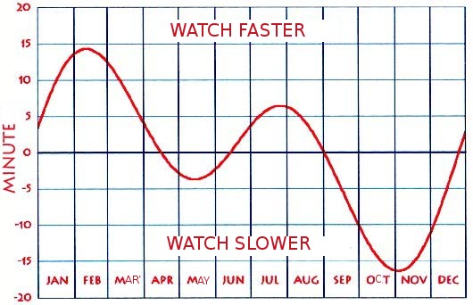
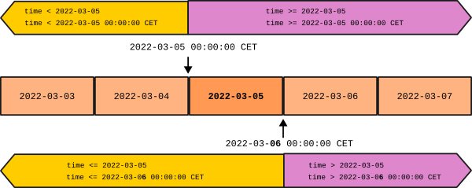

# Representando el tiempo

Existen diversas convenciones y formatos para representar el tiempo.
Hay que tenerlas en cuenta cuando las usamos para no introducir bugs.
Esta guía pretende clarificar conceptos y establecer ciertas convenciones y prácticas
que faciliten la manipulación de marcas temporales.


## Conceptos

### TL;DR

- **UTC:** Hora de referencia internacional. La antigua hora solar media de Greenwich, GMT, pero con algunos ajustes técnicos..
- **UTC Offset:** Diferencia de un sistema horario con UTC. Se expresa UTC+-HH:MM
- **Huso horario:** UTF offsets en horas enteras. De UTC-12 a UTC+12. Hay unos pocos estándares con offsets no de horas enteras.
- **Standard Time (ST):** Sistema horario usado en una región (WET, CET, PST, WAT, CAT...), se corresponde con un UTC offset.
- **Daylight Saving Time (DST):** Sistema horario alternativo a un Standard Time para el periodo de verano (WEST, CEST, PDT, WAST, CAST...)
- **Time Zone (TZ):** Zona en la que se aplica un Standard Time (y su pareja DST, si toca)
- **Local time:** Hora que se aplica oficialmente en una ciudad de referencia en cada momento.
	- Cambios en la oficialidad de un sitio implica cambios en como obtener la hora local.
- **Europe/Madrid:** Es nuestro local time.
	- Actualmente CET(UTC+1)/CEST(UTC+2) con cambio de horario el último domingo de octubre y de marzo a la 01:00 UTC.
	- Históricamente ha cambiado y puede cambiar: Fue WET/WEST, DST se ha aplicado de forma intermitente, y ha habido otros criterios para el cambio DST.
	- Africa/Ceuta es igual que Europe/Madrid
	- Atlantic/Canary que es WET(UTC+0)/WEST(UTC+1). Cambia a DST simultaneamente, a la 1:00 UTC (1:00 local en vez de 2:00)
- **IANA TZ Database:** Compilación histórica de los sistemas horarios que se aplican a ciertas ciudades de referencia.

Si te interesa profundizar en el origen y motivación de estos conceptos, sigue leyendo.
Si no, puedes saltar a los apartados de ambiguedades y convenciones.

### Hora solar media (Mean solar time)

En el siglo XIX funcionabamos con la hora solar media de cada ciudad.
La **hora solar media** es la que sincroniza las 12h del mediodía con el apogeo del sol.
Le llamamos _media_, porque el movimiento relativo entre la tierra y el sol
avanza o atrasa el apogeo dependiendo de la época del año,
así que se toma la hora promedio.



Con hora solar media,
era necesario ir ajustando el reloj a poco que nos movamos al este o al oeste.
Por ejemplo, entre la hora solar de Girona y la de Lleida,
el desfase es de casi 9 minutos, 1 minuto cada 20km en esa latitud.

### Hora estándard (Standard Time) y Zona horaria (Time Zone)

A la que aparecieron los trenes, con sus horarios de paso,
y las comunicaciones a distancia como el telégrafo y el teléfono,
esa asincronía se volvio insostenible.
Por eso se establecieron regiones (**zonas horarias**)
en la que todos los relojes están sincronizados a una misma **hora estándar** (Standard time).
Dentro de una zona horaria ya no haría falta ajustar el reloj, sólo cuando pasases de una zona a otra.

### UTC, offsets y husos horarios

Las primeras horas estándar, a finales del siglo XIX,
eran propias de cada país, y usaban como referencia,
el tiempo solar medio de su capital o de su centro geográfico.
Ajustar el horario entre paises era un horror.
Por ejemplo, entre Irán y Reino Unido, el desfase era de +03:25:44.

Enseguida se propuso
fijar una referencia universal y saltos de horas enteras en regiones llamadas husos horarios.
La propuesta la hizo el canadiense Sandford Fleming en 1883, y,
aunque no se aprobó internacionalmente hasta 1912,
en 1900 ya la habían adoptado la mayoría de paises, entre ellos, España.

Como referencia de tiempo universal se adoptó el estándar inglés:
La hora solar media en el observatorio de Greenwich, en Londres,
el **Greenwich Mean Time (GMT)**. También es el meridiano origen de la longitud.
En la actualidad, usamos el **UTC (Universal Time Coordinated)** que es una redefinición más precisa del GMT.

La diferencia de un estándard horario con UTC la llamamos **desplazamiento UTC** (UTC offset) y se expresa `UTC+-HH`.
Podemos añadir minutos y segundos al offset si hiciera falta.
El antiguo Tehran Mean Time era `UTC+03:25:44`.

La otra aportación de Fleming fueron los **husos horarios**.
Son franjas terrestres de 15 grados de longitud
(el giro de la tierra en una hora)
a las que corresponderia un offset UTC de horas enteras.
Ello limitaría la divergencia con la hora solar a media hora más o menos.

- El huso de referencia, centrado en el meridiano de Greenwich tiene la hora UTC+00.
- Los husos al este desfasan una hora más cada uno UTC+1, UTC+2..., UTC+12.
- Los husos al oeste defasan una hora menos cada uno UTC-1, UTC-2..., UTC-12.
- Los husos UTC+12 y UTC-12 son la mitad de anchos, y los separa el anti-meridiano de Greenwich que define el cambio internacional de dia.


Si observas el mapa actual de zonas horarias,
verás que los husos como delimitación geográfica
apenas se usan en tierra, sólo en alta mar.
Si que triunfó la idea de offsets enteros
que se aplica en todos sitios menos en las zonas ralladas.

### Denominación militar/radiofónica de los husos

La propuesta de Flemming asignaba a cada huso una letra del abecedario.
Aunque esa parte de la propuesta no se aceptó,
se usa en ambitos donde premia la comunicación por radio,
como el militar, naval o aviación.
De hecho es comun usar [la palabra internacional de deletreo de esa letra](https://en.wikipedia.org/wiki/NATO_phonetic_alphabet):
(Alpha, Bravo, Charlie, Delta...)

- Z para UTC+00 (Zulú)
- hacia el este A=UTC+1 (Alpha) hasta M=UTC+12 (Mike), saltandose la J
- hacia el oeste N=UTC-1 (November) hasta Y=UTC-12 (Yankee)
- La J (Juliet) es para designar la hora local cuando es común entre las partes

Algunos estándares informáticos usan la Z para referirse a UTC.
Las demás letras no se usan tanto.

### Zonas horaria modernas (time zones)

Aunque las naciones vieron con buenos ojos los defases en horas enteras de una hora universal,
no triunfó tanto la idea de delimitar las zonas horarias con meridianos.
Era preferible hacerlos coincidir con los límites políticos existentes: paises, provincias o zonas económicas.

- Por un lado es más fácil saber cuando cambias de zona horaria si coincide con un límite ya conocido.
- Por otro, se vió más útil mantener una hora comun con los vecinos que limitar el desajuste solar a media hora.

Por eso gran parte de la Europa occidental, incluida España, Francia y el Benelux, usa un huso horario que no le corresponde, el de Alemania.
Por eso Galicia, comparte hora con el resto de España peninsular aunque le corresponda el siguiente huso.
Al final, Galicia y el este de Polonia comparten zona horaria
aunque la diferencia solar entre ellas sea de 2 horas y cuarto.

No todos los paises están en un huso horario de horas enteras respecto a UTC.
Algunos paises que quedaban partidos en dos husos,
decidieron adoptar un desfase a la media hora para todo el país.
Tal es el caso, por ejemplo, de la India (+5:30) e Iran (+3:30),
y durante algunos años, Venezuela (-04:30 en vez del -4 actual).

Las horas estándares que se definieron,
ya con UTC como referencia,
tienen nombres estandarizados que referencian su zona de aplicación
y también se refieren por sus siglas.
Ojo: las siglas no son unicas, y muchas horas estándares coinciden en el mismo offset.

- West Europe Time (WET) UTF+00
- Central Europe Time (CET) UTF+01
- Central African Time (CAT) UTF+01
- Pacific Standard Time (PST) UTF-08
- Atlantic Standard Time (AST) UTF-05
- ...


### Daylight saving time (DST)

En las sociedades rurales, el inicio diario de la actividad humana se vinculaba al amanecer.
En contraste, las sociedades industriales, vinculan el inicio de la actividad a un horario.
El uso de la hora solar media, ancló el horario al mediodía,
haciendo que la hora del amanecer divergiera mucho entre verano e invierno,
y con ello las horas de provecho de la luz solar.
Para reducir esta variación de la hora del amanecer
algunos paises empezaron a establecer el horario de verano,
durante el cual se adelanta el reloj una hora.


Efecto de el DST en la hora del amanecer en Bilbo

En general, estas medidas se han introducido
en tiempos de guerra o en crisis energéticas o por presión industrial.
Hoy en día, se discute su utilidad energética.

Cada horario estándar (_standard time_),
puede tener aparejado una horario de verano (_daylight saving time_):

- West Europe Time (WET) -> West Europe Summer Time (WEST)
- Pacific Standard Time (PST) -> Pacific Daylight saving Time (PDT)
- ...

Destáquese que se mantienen nombres diferentes aunque CET (Central European Time)
y WEST (West European Summer Time) sean ambos equivalentes a UTC+01.


### Hora local (_local time_)

Aunque los estándares horarios están bien definidos,
en una región concreta se puede cambiar a otro estándar horario.
De hecho pueden decidir:

- Cambiar a otro estándar horario
- Activar o desactivar el DST
- Modificar los periódos en que se aplica DST

Por eso es importante el concepto de hora local:
La hora oficial que se aplica en una ciudad de referencia a través de todos esos cambios en el tiempo.

La IANA mantiene una base de datos con las horas locales
para ciudades y territorios de referencia y todos sus cambios desde 1970.
Las ciudades de referencia tienen identificadores tipo:
`Africa/Algiers`, `Antarctica/Macquarie`, `Pacific/Canary`, `Europe/Berlin`...
La primera parte els el ámbito continental o oceánico.
Estas bases de datos nos permiten calcular la hora local equivalente de una hora UTC.

Lamentablemente, en las librerías se llama normalmente Time Zone
a conceptos esencialmente diferentes:

- A los husos horarios o UTC offsets (Zulu, UTC+02...)
- A una hora estándard o DST concreta aplicada a una zona (CET, CEST, WET, WEST...)
- A la zona donde se aplican una pareja de horas standard/DST (CET/CEST, WET/WEST...)
- A la oficialidad de un lugar (Europe/Madrid) que hoy puede ser CET/CEST pero que mañana puede cambiar a WET/WEST o WET, o pueden establecer dias diferentes de transicion DST.

### Europe/Madrid

Nuestra hora local oficial es la hora de Madrid (Europe/Madrid).
La compartimos con Paris, Berlin, Varsovia...
Cuando hablemos de hora local nos referiremos a esta.

Tenemos dos TZ diferentes en verano y en invierno:

- CET (Central European Time, UTC+1)
- CEST (Central European Summer Time, UTC+2)

El cambio DST se hace

- Último domingo de Marzo a la 1:00 UTC
- Último domingo de Octubre a la 1:00 UTC

No siempre ha sido así, y puede cambiar,
así que no se puede tomar como regla general.
Hay que confiar en las implementaciones de tz's que
consideran los cambios históricos y
se actualizarán con los cambios futuros.

Tambien existen las horas locales de Africa/Ceuta, que coincide con Europe/Madrid,
y Atlantic/Canary.
Atlantic/Canary usa WET(UTC+0)/WEST(UTC+1) como st y dst
Hace los cambios a UTC simultaneamente con Madrid a la misma hora UTC (a diferente hora local!)
de forma que siempre hay un offset de una hora entre Canary y Madrid.
Esto quiere decir que el canvio ST-DST se hace a las 2 en peninsula y a la 1 en Canarias.

### Historia de Europe/Madrid

España estandarizó su hora para península y baleares en 1900,
adoptando GMT+00 al ser el huso predominante en la península (el oeste de Galicia le hubiera tocado GMT-01).
Canarias estandarizó su hora poco despues a GMT-01.
El 16 marzo de 1940, España sincronizó la hora con la de Alemania,
igual que hicieron los territorios ocupados de Francia y Benelux durante la IIGM.
Desde entonces todos esos paises usamos CET en vez de el WET que nos tocaría por huso.


A pesar del desfase horario, muchas costumbres como las comidas
o incluso los horarios laborales estan desplazados en el horario para ajustarlo al ritmo solar.

En España tenemos DST desde la crisis del petróleo del 78.
Pero ya habíamos coqueteado con la idea varias veces durante los últimos siglos.
Hasta 

[Histórico de cambios de horario en España](https://en.wikipedia.org/wiki/Time_in_Spain#Dates_of_Daylight_Saving_Time_and_other_changes)

## Ambiguedades y convenciones

### Estratégia del sandwich 🍔

La _estragégia del Sandwich_ es una estrategia general,
no solo para formatos de tiempo,
para lidiar con datos
que pueden representarse de formas diferentes y, a veces, ambiguas.

Consiste en uniformar internamente una convención única y universal,
idealmente, que no pierda información respecto a las otras,
y gestionar la heterogeneidad, vía conversiones,
en las interfícies con las fuentes de dicha heterogeneidad.

Tiene estos beneficios:

- El código interno es más simple, pues sólo gestiona una convención.
- Limitamos las conversiones que tenemos que implementar: De todas a la lengua franca y al reves y no todas con todas. (O(N) vs O(N²))
- En los puntos frontera es donde es más probable que conozcamos las convenciones externas que se usa en cada elemento externo y por tanto la conversión a usar.

Por ejemplo, en el caso de texto internacional, podemos tener
una representación interna UTF8 y,
tener en cuenta que codificacion usa una fuente de datos para convertirlo a UTF8.
Contra más capas de nuestro sistema cruce ese dato sin convertirse a la lengua franca,
mas capas tendran que gestionar esos multiples formatos y
más probable es que perdamos la informació sobre cual era el formato original.

### Ambigüedad de las horas naive

Una **representación horaria naive**
es la que no aporta información explícita
sobre a qué estándar de hora o offset UTC se refiere.
Lo contrario es una representación con TZ explícito.

Las representaciones naive son ambiguas
y necesitan convenciones o información adicional para desambiguarlas.
Usando la estrategia sandwich,
averiguaremos la convención que usa la fuente
para convertirlas en tiempos con tz explicitos
tan pronto lleguen al sistema.

### Ambiguedad debido al DST

Debido al DST, la hora local es ambigua aunque se nos diga que es de Europe/Madrid.

- Hay una hora local que no existe: de 2:00 a 3:00 del ultimo domingo de marzo
- Hay una hora local repetida: de 2:00 a 3:00 del ultimo domingo de octubre

Cuando recibimos un tiempo en local time,
deberíamos recibirlo, bien con el timezone informado,
o bien con un flag de DST.
En el segundo caso, aplicando sandwich, lo convertimos a time zone informado.

### Mutabilidad de la hora local

Históricamente los criterios para determinar la hora local han variado.

- El offset standard (Madrid cambió de WET a CET en 1940 y hay propuestas de restablecer WET)
- Si hay o no DST (cambió 6 veces en el siglo XX, y hay propuestas de eliminarlo)
- Cuando se produce el cambio de hora (el criterio actual se estableció en 1996)

Por ello, se recomienda no programar explícitamente estos criterios
y delegar en librerías especializadas, que mantienen la base de datos
de timezones.

También se recomienda cuando convirtamos a hora local,
normalmente para presentarla al usuario,
no conviene averiguar nosotros si toca CET o CEST para aplicar el offset,
sinó usar la hora local _Europe/Madrid_
y la libreria de TZ ya nos indicara el offset o el standard time para una hora UTC.

### Naividad de las fechas

Podríamos pensar que las fechas, puesto que no indican hora,
no tienen problema de timezone, ni de dst.
Y así lo podemos considerar mientras solo operemos con fechas.

Pero una fecha es un intervalo temporal de las 00h a las 24h,
y ese intervalo es diferente, otra vez, dependiendo de la hora local.
Esto cobra importancia cuando empezamos a mezclar fechas con horas.

En ese sentido hay que considerar las fechas como tiempos naive.


Normalmente, cuando una usuaria indica una fecha,
se refiere no a la hora UTC sinó a la local.

Por ejemplo, el día 2022-03-05 en Madrid empieza a las `2022-03-0 23:00 CET` que corresponde a `2022-03-04 23:00Z`.

Cuando vayamos a usar fechas para compararlas con datetimes,
necesitamos saber que convencion se usa en las fechas.
Normalmente se referiran al día en la hora local, aunque no está de más comprobarlo.
Además ¿qué hora local? ¿la del usuario? ¿la del servidor? ¿la del lugar de la recogida de datos?

Una buena aproximación es convertir la fecha a la hora 00:00:00 local del día en cuestión.
Nos sirve para comparar con fechas anteriores o posteriores e iguales.

	Comprobar si un tiempo es anterior a una fecha:
		2020-03-04T23:59:59CET < 2020-03-05?
			2020-03-05 -> 2020-03-05T00:00:00CET # Convertimos a localtime a las 00:00
			2020-03-04T23:59:59CET < 2020-03-05T00:00:00CET # Comparamos
	
	Comprobar si un tiempo es posterior o igual a una fecha:
		2020-03-04T23:59:59CET >= 2020-03-05?
			2020-03-05 -> 2020-03-05T00:00:00CET # Convertimos a localtime a las 00:00
			2020-03-04T23:59:59CET >= 2020-03-05T00:00:00CET # Comparamos

Sin embargo, para comparar tiempos posteriores o menores e iguales a una fecha,
deberíamos añadirle un día antes de convertirlo a local.
Un día y no 24h porque hay dias que por el DST tiene 23 o 25 horas.

	Comprobar si un tiempo es posterior a una fecha:
		2020-03-04T23:59:59CET > 2020-03-05?
			2020-03-05 -> 2020-03-06 # Añadimos un dia a la fecha (que no 24h por que hay dias de 23 y 25)
			2020-03-06 -> 2020-03-06T00:00:00CET # Convertimos a localtime a las 00:00
			2020-03-04T23:59:59CET < 2020-03-06T00:00:00CET # Comparamos
	
	Comprobar si un tiempo es anterior o igual a una fecha:
		2020-03-04T23:59:59CET <= 2020-03-05?
			2020-03-05 -> 2020-03-05T00:00:00CET # Convertimos a localtime a las 00:00
			2020-03-04T23:59:59CET <= 2020-03-05T00:00:00CET # Comparamos





Dado que la fecha no tiene informado el TZ,
¿necesitamos indicar el DST para convertirla en tiempo local con TZ informado?
No, porque a las 00:00 locales no hay ambiguedad, por la fecha sabremos si es DST o no.


## Representaciones


### Texto ISO Format

El estándard [ISO 8601](https://en.wikipedia.org/wiki/ISO_8601)
establece una forma uniforme de representar el tiempo como texto.
No substituye a la representación en lenguaje natural como "3 de mayo de 2020",
pero si uniformiza las diferentes convenciones para representar fechas y horas.

Si dos objetos son del mismo tipo y de la misma zona horaria,
coincide el orden cronologico y el lexicografico.

- ISO dates: "YYYY-MM-DD"
- Naive ISO datetimes: "YYYY-MM-DD hh:mm:ss"
- UTC ISO datetimes: "YYYY-MM-DD hh:mm:ssZ" or "YYYY-MM-DD hh:mm:ss+00:00"
- TZ iso datetimes: ""YYYY-MM-DD hh:mm:ss+02:00"

Convenciones:

- Naive iso datetimes son ambiguas
	- El estandard dice que si no hay TZ, es local/juliet
	- Si es local, hay que convenir qué local es (usuario, servidor, lugar de obtención...)
	- Si es local, a parte se necesita información adicional de DST
	- Algunos entornos consideran la convencion que Naive es UTC para desambiguarlas
	- En general, se recomienda no usar naives para no tener que usar convenciones adicionales
- Fechas naive se consideran 00:00 localtime, no hay ambiguedad de DST pero requiere convencion de qué es Juliet
	- Adición de dias en isodate se ha de hacer en dias no en horas puesto que las horas del dia local varian entre 23 y 25.
	- Peligro: Cuando comparamos como texto isodates, si no son del mismo tipo
		- Comparing with an UTC datetime, the first hours of the day in UTC are less than the date 
			- `"2022-08-01 23:30Z" < "2022-08-02"` but `isodatetimetz("2022-08-01 23:30Z")>localisodate("2022-08-02")`
- El uso de separadores '-' y ':' es opcional pero recomendado por legibilidad. Nosotros lo forzamos por eso mismo.
- También se permite 'T' o espacios como separador entre dia y hora.
	- JSON requiere 'T'. yamlns usa espacio.
- UTC can be marked either as Z or as offset +00, -00:00
- Smaller time elements can be dropped, meaning 00
- Smaller timezone elements can be dropped, meaning 00

La especificación permite duraciones, intervalos, repeticiones, semanas del año, dias del año y la semana...
De momento no cubrimos nada de eso.


### Timestamp or time since Epoch

Tiempo desde epoch (o también (UNIX/POSIX) timestamp)
es una representación numérica del tiempo mediante, por ejemplo,
los segundos transcurridos desde una momento de referencia o epoch.

Es un numero dificil de interpretar, pero fácil de obtener, comparar, restar...

Internamente en POSIX y por extension en otros sistemas,
el tiempo se representa numéricamente
como los segundos transcurridos desde el EPOCH UNIX (January 1s 1970 00:00+00).

A determinar:

- Las unidades: segundos, milisegundos, microsegundos...
- La representación puede ser entera o float
	- Float permite granularidad menor pero manteniendo compatibilidad en unidades.
	- Ojo con los ints y el oferflow (efecto 2038 si seusan 32 bits)
	- Ojo con los floats y la precisión (a menudo que el numero se hace grande baja en precision)
- Las 00:00 de referencia del EPOCH pueden ser UTC... o no
	- Se recomienda UTC pero no tiene porqué ni hay forma de indicarlo

### Tupla tiempo

Otra representación típica es una tupla o estructura
que contiene númericamente los diferentes niveles de tiempo:
año, mes...


# WIP - A partir de aquí es Work In Progress

### Python

A parte de las representaciones en string y timestamp numérico,
existen los objetos del paquete `datetime`.

- isodate
- isodatetime naive
- isodatetime tz
- utc timestamp ms
- date
- datetime naive
- datetime con tzinfo

Conversions:

- `utctimestamp_s(utctimestamp_s)`: utctimestamp_s -> utcdatetime
- `as_utctimestamp_s(utcdatetime)`: utcdatetime -> utctimestamp_s
- `as_utctimestamp_s(localdatetime)`: localdatetime -> utctimestamp_s
- `as_utctimestamp_s(naivedatetime)`: naivedatetime (utc) -> utctimestamp_s
- `localtimestamp_s(localtimestamp_s)`: localtimestamp -> localdatetime
- `as_localtimestamp_s(localdatetime)`: localdatetime -> localtimestamp_s
- `as_localtimestamp_s(utcdatetime)`: localdatetime -> utcdatetime -> localtimestamp_s
- `isodate(isodate)`: isodate -> date
- `date_as_localdatetime(date)`: date (local) -> localdatetime
- localdatetime -> date (local)
- `as_utc(localdatetime)` localdatetime -> utcdatetime (conversion)
- `as_utc(naivedatetime)`: naivedatetime (utc) -> utcdatetime (reinterpret)
- `as_local(utcdatetime)`: utcdatetime -> localdatetime (conversion)
- `as_local(naivedatetime, dst)`: naivedatetime (local) + dst -> localdatetime (reinterpret)
- `isodatetime(naiveisodatetime)`: naiveisodatetime -> naivedatetime
- `isodatetime(tzisodatetime)`: tzisodatetime -> local/utcdatetime
- `as_isodate(utcdatetime)`: utcdatetime -> localdatetime -> date
- `as_isodate(localdatetime)`: localdatetime -> date
- `as_isodate(naivedatetime)`: naivedatetime (local) -> date (takes the date pare as it were local????)
- naiveisodatetime + dst -> localdatetime
- utc/localisodatetime -> localdatetime
- localdatetime -> naivedatetime + dst


### Javascript

Representaciones posibles

- new Date
- momentjs
- dayjs
- strings ISO


#### Standard JS Date

A diferencia del `datetime` de Python,
`Date` de Javascript no tiene una versión naive.
Siempre representa un instante UTC.

Sin embargo tenemos que ir con cuidado
puesto que la interfaz es dual,
y a veces usa hora local y a veces hora UTC.

Además, cuando usamos la hora local,
se usa la **hora local del Navegador!**
lo que da al desarrollador muy poco control
sobre lo que pasa.

- Los accesores set/getMinutes/Hours/Days... consideran la hora local
- Tenemos los accesores set/getUTCMinutes/Hours/Days... que consideran hora UTC
- Si lo mostramos por consola, imprimirá la hora local.

El problema es:

- La hora local depende del navegador
- No hay utilidades estandard para obtener otras representaciones.

Para nosotros se nos manifiesta el problema cuando:

- la usuaria no esta en el país o está en Canarias, o por lo que sea tiene el ordenador configurado en otra zona horaria
- queremos representar cosas (produccion de plantas, consumos de suministros) de Canarias

```javascript
// El Epoch es Unix time UTC 1970-01-01T00:00:00Z
>> new Date(0)
Date Thu Jan 01 1970 01:00:00 GMT+0100 (Hora estàndard del Centre d’Europa)

// Y en milisegundos
>> new Date(10*1000) // 10 seconds after epoch
Date Thu Jan 01 1970 01:00:10 GMT+0100 (Hora estàndard del Centre d’Europa)

// Las fechas ISO naive se suponen UTC, NO LOCALES!!
// Cuando comparamos fechas, normalmente nos interesan las de Europe/Madrid o Pacific/Canary
>> new Date("2023-02-02")
Date Thu Feb 02 2023 01:00:00 GMT+0100 (Hora estàndard del Centre d’Europa)

// En cambio, si indicamos la hora sin TZ, se supone la local del navegador!!
>> new Date("2023-02-02T00:00:00")
Date Thu Feb 02 2023 00:00:00 GMT+0100 (Hora estàndard del Centre d’Europa)

// Para indicar UTC, añadir Zulu
>> new Date("2023-02-02T00:00:00Z")
Date Thu Feb 02 2023 01:00:00 GMT+0100 (Hora estàndard del Centre d’Europa)

// Las fechas se serializan en ISO UTC
>> JSON.stringify(new Date("2023-02-02T00:00:00"))
'"2023-02-01T23:00:00.000Z"'

// Pero se deserializan como strings!!!
>> JSON.parse('"2023-02-01T23:00:00.000Z"')
"2023-02-01T23:00:00.000Z"

>> new Date(JSON.parse('"2023-02-01T23:00:00.000Z"'))


>> Date.UTC(2020, 2, 2) // default month=1, date=1, hour=0, minutes=0, seconds=0

// OJO: si nos olvidamos `new` devuelve un string no manipulable de la fecha local actual
>> Date("2020-03-02T00:00:00Z")
"Wed Jul 17 2024 02:47:40 GMT+0200 (Hora d’estiu del Centre d’Europa)"
// Nada que ver con el parámetro
```

TODO: Aritmetica temporal

- Obtener el inicio de la fecha local
	```javascript
	function localDateStart(date) {
		const d = new Date(date)
		d.setHours(0)
		d.setMinutes(0)
		d.setSeconds(0)
		d.setMilliseconds(0)
		return d
	}
	```

- Como añadir dias locales
	- No sumar 24h por dia: Hay cambios de DST!!
	- `new Date(new Date(d).setDate(d.getDate() + daysOffset))`
	```javascript
	function addDays(d, ndays) {
		return new Date(new Date(d).setDate(d.getDate()+ndays))
	}
	```
	- Manejar en lo posible fechas a las 00:00 local
	- Esto se hace en hora local del navegador
- Como añadir años
	- No sumar 365 dias, hay años bisiestos!
	- `new Date(new Date(d).setFullYear(d.getFullYear() + yearsOffset))
	- Ajusta a los bisiestos:
		- El 29 de febrero bisiesto lo mueve al 1 de Marzo en años no bisiestos.
		- El resto de fechas las mueve a la misma fecha.
- Como añadir meses
	- No sumar 30 dias... pues claro.
	- new Date(new Date(d).setMonth(d.getMonth()+2)).toISOString()
	- Dias 29, 30 o 31 que no existen en el mes destino, pasa los dias sobrantes al siguiente mes.
		- 2020-01-31T10:00Z -> +1mes -> 2020-03-03T10:00:00Z
- Como ubicar tiempos en intervalos de fechas locales
	- Como vienen las fechas, en local o en UTC?
		- Normalmente queremos ubicar dias locales
		- Las fechas ISO se traducen a UTC (00:00Z)

```javascript
// Local month offset beyond month
>> d = new Date("2021-01-31T10:00Z")
>> new Date(new Date(d).setMonth(d.getMonth()+1)).toISOString()
"2020-03-03T10:00:00.000Z"
```

TODO: Libreria momentjs

TODO: Libreria dayjs


dayjs(utc_timestamp_ms) -> local datetime


Yup `date` valida y convierte ISO strings en Date. Para obtenerlo. `schema.cast(JSON.parse(jsonstring))`
- `yup.string().datetime() ([doc](https://github.com/jquense/yup?tab=readme-ov-file#stringdatetimeoptions-message-string--function-allowoffset-boolean-precision-number))
	- No convierte a Date, solo parsea y valida, lo mantiene como string
	- Solo acepta Zulus, no naives ni otros tz
- `yup.date()`
	- Convierte a Date si hacemos `schema.cast(jsondata)`

Zod
- `z.date()`
	- Por defecto solo acepta `Date`
	- Para hacer conversion: `z.coerce.Date`, pasa el campo por el constructor de `Date`
	- En ese caso, acepta formatos no ISO como el constructor de Date
- `z.string().datetime()` ([doc](https://zod.dev/?id=datetimes))
	- Soporta solo Zulus no otros offsets, o naives
	- Se come cosas invalidas (no comprueba fechas imposibles)
	- No convierte, sigue siendo un string
- Como parsear solo iso y obtener Dates??


### ERP

### Postgresql

- Mogrifying dates (query search)
- Inserting data
- Extracting data

### JSON

El tiempo no tienen representación nativa en JSON.
Se suelen representar por una string ISO en UTC pero es un string.
Javascript, por ejemplo, serializa Dates como strings iso en zulu pero despues no las deserializa.

```javascript
> new Date("2022-01-01T22:00+01:00").toJSON()
'2022-01-01T21:00:00.000Z'
> new Date("2022-01-01T22:00+01:00").toISOString()
'2022-01-01T21:00:00.000Z'
> JSON.stringify(new Date("2022-01-01T22:00+01:00"))
'"2022-01-01T21:00:00.000Z"' // note the quotes
> JSON.parse('"2022-01-01T22:00:00.000Z"')
'2022-01-01T22:00:00.000Z'  // just string, must call  new Date() to get the date.
```

Otra representación típica es con los milisegundos despues del Epoch UTC.
En cualquier caso, ha de ser una convención.

### YAML

YAML si que tiene formato de tiempo definido. https://yaml.org/type/timestamp.html
Usa formato ISO con las siguientes consideraciones:

- Les corresponde el tag `!!timestamp`
	- no se indica ya que es uno de los tags detectados por defecto
	- al reves si quisieramos representar un string iso como string añadiriamos `!!str`
- El formato canónico es YYYY-MM-DDTHH:MM:SSZ, opcionalmente con milisegundos
- Formatos no canónicos aceptados:
	- En vez de `T`, `t` (minúscula) o uno o varios espacios o tabuladores.
	- Separar opcionalmente el TZ con espacios
	- No especificar la hora, se supone 00:00:00Z
	- No especificar el TZ, se supone Z

**Ojo:** Una fecha sin TZ en YAML se considera Zulu, una fecha sin TZ en JS se considera Juliet


### Mongo


# Discusion inicial

naive: no incluye el timezone (datetimes, isodatetime) necesitamos saber que es para interpretarlo.

tz: incluye el timezone (datetimes, isodatetime) es implicito que es.

Semantica:

	- local: la hora local, en nuestro código, es Madrid
		- si es un formato naive, necesitamos un season para
		  identificar la hora real (hay horas en el cambio
		  de horario que se duplican)
	- utc: hora zulu, Tiempo Universal Coordinado

Formatos:

	- date: datetime.date(y,m,d)
	- isodate: "YYYY-MM-DD"
		- Cuando comparamos fechas con tiempo, se le supone 00:00:00
		seria un naive, y habria que interpretarlo como tz con
		la semantica que tenga (usualmente local, no utc)
	- naive_datetime: datetime.datetime(y,m,d,h,m,s)
	- tz_datetime: datetime.datetime(y,m,d,h,m,s,zone_info=tz)
	- isodatetime: "YYYY-MM-DD HH:MM:SS"
	- tz_isodatetime: "YYYY-MM-DD HH:MM:SS+02:00"
	- timestamp: miliseconds or seconds since epoch (1 enero 1970)
		- Puede ser local o utc
		- Puede estar en milisegundos o en segundos
		- Puede ser entero o float


